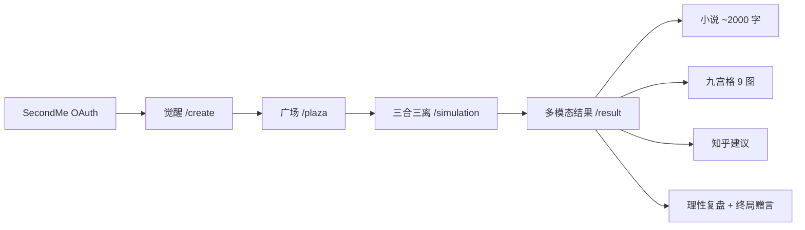

# 命中注定的离别

A2A 情感推演平台（黑客松 Demo）：
- SecondMe OAuth 登录
- 分身降生（MBTI + 出生信息 -> 数字命盘）
- 宿命推演引擎（初遇/冲突/离别）
- 多模态结果（小说 + 漫画提示词 + 图片）
- 知乎建议（可降级为 Mock）

## 1) 准备环境变量

复制模板文件并填入你的配置：

```bash
cp .env.local.example .env.local
```

**切勿将 `.env.local` 提交到 Git 或粘贴到公开聊天。** 密钥泄露后请立即在平台侧轮换。

必填项：
- `SECONDME_CLIENT_ID`
- `SECONDME_CLIENT_SECRET`
- `SECONDME_REDIRECT_URI`（本地默认 `http://localhost:3000/api/auth/secondme/callback`）

大模型（二选一或组合）：
- **MiniMax**：`MINIMAX_API_KEY` + `MINIMAX_GROUP_ID`（控制台获取 GroupId）；配置后默认优先于 OpenAI。
- **OpenAI**：`OPENAI_API_KEY`（未配置 MiniMax 时使用）
- 可选 `LLM_PROVIDER=minimax|openai` 强制指定

知乎建议（可选）：
- `ZHIHU_API_BASE_URL`、`ZHIHU_API_TOKEN`、`ZHIHU_API_KEY`（具体头名可用 `ZHIHU_KEY_HEADER` 调整）

## 2) 启动项目

```bash
npm run dev
```

打开 `http://localhost:3000`。

## 生产部署（Vercel）

完整步骤（SecondMe 回调 URL、环境变量、验证清单）见：**[`docs/deploy-vercel.md`](docs/deploy-vercel.md)**。

## 3) 页面流程

- `/`：项目入口、登录与快捷按钮、**SOP 步骤导航**
- `/create`：觉醒 + Twin 报告 + 命盘
- `/plaza`：Discover + 邀请房 + 锁定搭档（写入 `partner_profile` localStorage）
- `/simulation`：三合三离 + 卦象槽 + A2A 时间轴
- `/result`：长篇、九宫格生图、知乎、理性复盘、终局赠言（可选轮回）

### 流程图（Mermaid）

在支持 Mermaid 的 Markdown 预览（如 GitHub）中可渲染：



## 4) API 接口（统一响应）

- `POST /api/destiny-profile`
- `POST /api/awaken`
- `GET /api/match/discover`（`DEMO_MODE=true` 时免 Token 返回 Mock）
- `GET|POST /api/match/invite`（创建/加入邀请房；`GET ?code=` 轮询）
- `POST /api/match/confirm`（锁定搭档，写入 `plaza_match` Cookie）
- `GET /api/match/partner`（读取 Cookie 中的匹配快照）
- `POST /api/simulate`（返回 `simulation: SimulationResult` 三合三离 + `events` 兼容旧版）
- `POST /api/novel`（`simulation` → 约 2000 字；仅 `events` → 约 500 字短篇）
- `POST /api/comic-prompts`（`simulation` → 9 条英文 prompt；仅 `events` → 3 条）
- `POST /api/generate-image`（`prompts` 最多 9 张，九宫格）
- `GET /api/zhihu-search?keyword=`
- `POST /api/rational-report`（`simulation` → 理性复盘长文）
- `POST /api/final-epitaph`（`simulation` + 可选 `novelExcerpt`）
- `POST /api/reincarnation`（需 `ENABLE_REINCARNATION=true`）

## 5) 关键文档

- `docs/technical-framework.md`：冻结架构、契约、阶段验收与降级策略
- `docs/judge-one-pager.md`：**对齐官方计分**（评委 70% + OAuth 用户 30%）与 5 分钟 Demo 顺序
- `docs/sop-core-vs-examples.md`：核心 SOP 与占位/示例边界

## A2A 说明（评委 40% 维度）

宿命推演采用 **双 Agent 轮次对话**（`user_agent` / `partner_agent`），每阶段输出 `a2aTurns` + 场景摘要，见 `src/lib/simulation-engine.ts` 与 `/simulation` 页面展示。

## 演示模式 & 拉票页

- **演示模式**：`.env` 中设置 `DEMO_MODE=true`（可选 `NEXT_PUBLIC_DEMO_MODE=true`），跳过外部 LLM/生图，使用 `src/lib/demo-data.ts` 固定数据。
- **一键演示**：访问 `/demo` 或 `GET /api/demo-bundle` 将演示数据写入 `localStorage`。
- **拉票落地页**：`/share` — 极简 OAuth 入口，便于传播拉 OAuth 授权数。
